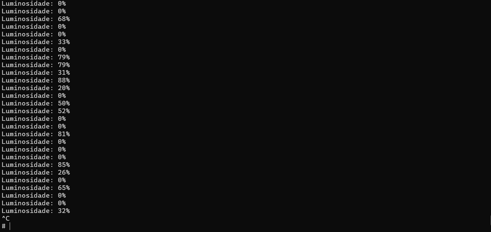

# Monitoramento de Carga com Sensor de Luminosidade (LDR) na STM32MP1

### Descrição Geral do Projeto

Este projeto implementa o **Módulo Sensor de Luminosidade** como parte de uma missão de Monitoramento Inteligente de Carga para o Exército Brasileiro. O objetivo é detectar a violação de um compartimento de carga sensível através da medição da luminosidade ambiente. Uma mudança súbita nos níveis de luz (de escuro para claro) indica uma possível abertura não autorizada, acionando um alerta no sistema central.

A solução foi desenvolvida para a placa **STM32MP1 DK1** e utiliza um sensor LDR (Resistor Dependente de Luz) para a aquisição de dados. O software foi implementado em C++ e encapsulado em uma classe para garantir a modularidade e facilitar a integração com outros sensores do sistema.

### Dependências Necessárias

Para compilar e gerar a documentação deste projeto, os seguintes pacotes são necessários:

* **Compilação:**
    * Um ambiente de compilação cruzada (cross-compilation) para ARM, como o `arm-linux-gnueabihf-g++`.
* **Documentação:**
    * **Doxygen:** Ferramenta para geração de documentação a partir do código-fonte.
    * **Graphviz (dot):** Ferramenta para a geração de diagramas e gráficos na documentação.

### Estrutura do Código e Explicação

O código-fonte está estruturado de forma modular para promover o encapsulamento e a clareza.

* **`SensorLDR` (Classe Principal):**
    * **Descrição:** Esta classe é responsável por toda a interação com o hardware do sensor LDR. Ela abstrai os detalhes de baixo nível da leitura do ADC (Conversor Analógico-Digital) via `sysfs` no Linux embarcado.
    * **Métodos Principais:**
        * `lerValor()`: Realiza a leitura do valor cru do ADC associado ao sensor.
        * `lerLuminosidadePercentual()`: Calcula a luminosidade em percentual com base no valor lido do ADC.

### Instruções de Compilação e Execução

Siga as etapas abaixo para compilar e executar o módulo do sensor.

1.  **Clonar o Repositório:**
    ```bash
    git clone [URL_DO_SEU_REPOSITORIO_AQUI]
    cd [NOME_DO_SEU_REPOSITORIO]
    ```

2.  **Compilar o Código (Cross-compilation):**
    1.  **Baixar a toolchain**: Baixe o arquivo `arm-buildroot-linux-gnueabihf_sdk-buildroot.tar.gz` nesse [link](https://drive.google.com/file/d/1qpq3QeK5f7T061LFA0JlJz2fgMQDvyMn/view). Esta toolchain permitirá a **compilação cruzada** para o kit de desenvolvimento DK1.
    2.  **Instalar a toolchain**: Extraia-o com o comando:
    ```bash
    tar -xvf arm-buildroot-linux-gnueabihf_sdk-buildroot.tar.gz
    ```
    3.  Execute o comando abaixo no seu ambiente de desenvolvimento para compilar o código para a arquitetura da placa STM32MP1.
    ```bash
    arm-linux-gnueabihf-g++ -o sensor_ldr_arm sensor_ldr.cpp
    ```

3.  **Executar na Placa STM32MP1:**
    1.  Transfira o arquivo executável `sensor_ldr_arm` para a placa via `scp`.
    2.  No terminal da placa, dê permissão de execução ao arquivo:
    ```bash
    chmod +x sensor_ldr_arm
    ```
    3.  Execute o programa:
    ```bash
    ./sensor_ldr_arm
    ```
    O programa começará a exibir as leituras de luminosidade no terminal.


### Exemplo de Execução: Monitoramento em Ação

Esta seção demonstra o comportamento esperado do programa **`sensor_ldr_arm`** em tempo real, mostrando como o valor do sensor de luminosidade é exibido no terminal.

O programa lê continuamente o valor bruto do canal (in_voltage13_raw), que representa o nível de luminosidade captado pelo sensor LDR.




### Geração da Documentação Doxygen em Vários Formatos

O `Doxyfile` é o arquivo central de configuração que diz ao Doxygen quais formatos de documentação devem ser gerados.

### Passo a Passo para Gerar LaTeX, RTF e HTML:

1.  Certifique-se de que o Doxygen e o Graphviz estão instalados.

2.  **Encontre seu `Doxyfile`**: Certifique-se de que você já tenha um `Doxyfile` no diretório raiz do seu projeto. Se não tiver, você pode gerá-lo usando o comando `doxygen -g`.

3.  **Edite o `Doxyfile`**: Abra o arquivo `Doxyfile` em um editor de texto (como o VS Code, Notepad++ ou Bloco de Notas).

4.  **Habilite os Formatos Desejados**: Procure pelas seguintes linhas e mude seus valores de `NO` para `YES`.

    ```
    GENERATE_HTML         = YES
    GENERATE_LATEX        = YES
    GENERATE_RTF          = YES
    HAVE_DOT              = YES
    COLLABORATION_GRAPH   = YES
    CLASS_GRAPH           = YES
    GROUP_GRAPHS          = YES
    INCLUDE_GRAPH         = YES
    INCLUDED_BY_GRAPH     = YES
    CALL_GRAPH            = YES
    DIRECTORY_GRAPH       = YES
    UML_LOOK              = YES
    TEMPLATE_RELATIONS    = YES
    GRAPHICAL_HIERARCHY   = YES
    ```

5.  **Execute o Doxygen**: Salve o `Doxyfile` e execute o comando `doxygen` na raiz do seu projeto.

    ```bash
    doxygen
    ```

### Resultados da Geração

Após a execução, o Doxygen criará as seguintes pastas no diretório do seu projeto (assumindo que as configurações padrão estejam ativadas):

* `html/`: Contém a documentação em formato de páginas web.
* `latex/`: Contém os arquivos-fonte `.tex` necessários para compilar um PDF da sua documentação. Para gerar o PDF, navegue até esta pasta no terminal e use o comando `make`.
* `rtf/`: Contém a documentação no formato Rich Text Format, que pode ser aberto por editores de texto como o Microsoft Word.

Navegue pelos diferentes formatos para explorar as classes, métodos e diagramas.


## Projeto Embarcado: Instruções de Diagnóstico e Comunicação UDP

Este guia se concentra na execução e verificação do Cliente (`clienteUDP_sensor_ldr.cpp`) na Placa Embarcada, que é responsável por enviar dados do sensor para o Host Windows (`192.168.42.10:8080`).

### 1. Configuração de Rede Essencial

O Cliente e o Servidor (Host Windows) devem estar na mesma sub-rede para comunicação direta:

| Componente | Endereço IP | Porta UDP | Detalhes no Código Cliente |
| :--- | :--- | :--- | :--- |
| **Cliente** (Placa Embarcada) | `192.168.42.2` | `8080` (Saída) | Código envia para `192.168.42.10` |
| **Servidor** (Windows Host) | `192.168.42.10` | `8080` (Entrada) | Destino final dos pacotes UDP. |

### 2. Execução do Cliente

   1.  **Compilação:** Compile o `clienteUDP_sensor_ldr.cpp` na Placa Embarcada (ambientes Linux/POSIX). O código já está corrigido para os erros de conversão.
   2.  **Execução:** Inicie o Cliente na Placa. Ele começará a enviar pacotes UDP a cada segundo para o Host Windows.
       ```bash
       ./clienteUDP_sensor_ldr
       ```
       *Saída esperada:* O terminal da Placa deve mostrar a mensagem de confirmação de envio para `192.168.42.10:8080`.

### 3. Diagnóstico de Envio de Dados (Ferramentas de Rede)

Para verificar se o pacote do Cliente está saindo da Placa e chegando na interface de rede do Windows, use o `ncat.exe`, o Wireshark ou um Código Servidor de Recebimento.

#### 3.1. Diagnóstico com `ncat` (Teste de Recebimento)

O `ncat` funciona como um "servidor de teste" simples para verificar se o pacote ultrapassa o Firewall.

   1.  **No PowerShell/CMD do Windows Host** (na pasta onde está o `ncat.exe`):
       ```powershell
       .\ncat.exe -ulnv 8080
       ```
       *O comando escuta (`-l`) na porta `8080` para pacotes UDP (`-u`) e é verboso (`-v`).*
   2.  **Inicie o Cliente** na Placa.

##### Análise do Resultado do `ncat`:

| Resultado do `ncat` (Windows Host) | Conclusão | Ação Necessária |
| :--- | :--- | :--- |
| **Recebe os dados (ex: '45', '100')** | O Cliente está enviando com sucesso, e a rede está OK. | O problema reside apenas no código/compilação do Servidor C++. |
| **NÃO recebe nada** | O pacote está sendo barrado antes de chegar ao aplicativo. | **Ação:** Vá para o Passo 3.3 (Firewall/Wireshark). |

#### 3.2. Diagnóstico com Wireshark (Teste de Chegada)

O Wireshark verifica se o pacote UDP está sequer alcançando a **interface de rede** do Windows (`192.168.42.10`).

   1.  **No Windows Host:** Abra o Wireshark.
   2.  Selecione a **Interface Ethernet** com o IP `192.168.42.10`.
   3.  Aplique o filtro: `udp and port 8080`.
   4.  **Inicie o Cliente** na Placa.

##### Análise do Wireshark:

* **Se o Wireshark MOSTRAR os pacotes:** O pacote está chegando ao Windows. O Firewall do Windows é o culpado por bloquear a entrega ao `ncat` (ou Servidor).
* **Se o Wireshark NÃO MOSTRAR os pacotes:** O pacote não está saindo da Placa ou há um problema de conectividade física (cabo/IPs).

#### 3.3. Solução do Firewall (Se Pacote Chegar, mas `ncat` Bloquear)

Se o Wireshark mostrar os pacotes, mas o `ncat` não os receber:

   1.  **Desativação Temporária:** Desative o Firewall do Windows Host **TEMPORARIAMENTE**. Se a comunicação funcionar, o Firewall é o problema.
   2.  **Solução Definitiva:** É necessário criar uma regra de Firewall de **Entrada (Inbound)** para o protocolo **UDP** na porta **8080**.

#### 3.4. Criação do Código Servidor de Recebimento

Para uma solução de monitoramento permanente no Host Windows, você pode criar um servidor UDP simples em C, C++ ou Python.

| Linguagem | Vantagem | Biblioteca-chave |
| :--- | :--- | :--- |
| **Python** | Ideal para prototipagem rápida e visualização. | `socket` |
| **C/C++** | Desempenho máximo e controle de baixo nível. | Windows Sockets (`winsock2.h`) |

O servidor deve:
   1.  Criar um socket UDP (`SOCK_DGRAM`).
   2.  Associar (bind) o socket ao endereço `192.168.42.10` (ou `0.0.0.0`) e à porta `8080`.
   3.  Entrar em um loop infinito, chamando `recvfrom()` ou função equivalente para aguardar os datagramas do Cliente.
   4.  Converter os dados recebidos (string/ASCII) de volta para um valor numérico para processamento.

### Exemplo de Execução: Logs de Envio do Cliente (Placa Embarcada)

Esta seção demonstra o comportamento esperado do programa **`clienteUDP_sensor_ldr`** ao ser executado na Placa Embarcada. Ele mostra o loop contínuo de leitura do sensor e o envio do datagrama UDP para o Servidor Windows.

O Cliente lê o valor de luminosidade, converte-o para um formato de texto (string) e o envia a cada 1 segundo (conforme o `sleep(1)` no código).


